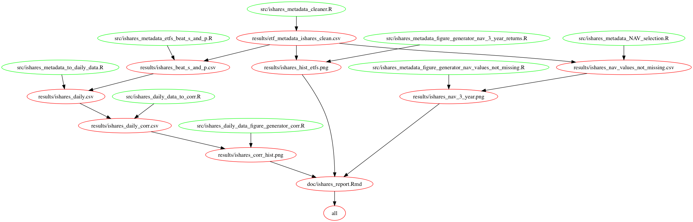

# README

Data analysis for etf_correlations.
Created by Daniel Raff daniel18raff@gmail.com.

Started on November 22nd, 2017.

`data` directory: Only raw data and metadata. These files are *not* to
be modified.

`doc` directory: text documents (eg: manuscripts, documentation, record of experiments)

`results` directory: intermediate results, cleaned data, final results, etc.

`src` directory: project source code

`misc` directory: Anything that is of poor quality and/or doesn't fit in above directories.

## Usage

Get Docker Image:
> `docker pull raffrica/etf_docker`

Clone the repo:
> `git clone https://github.com/raffrica/etf_correlations.git`

Run the Docker Image:
> docker run -it --rm -v YOUR_LOCAL_DIRECTORY_OF_CLONED_REPO/:/home/etf_correlations raffrica/etf_docker  /bin/bash

Change Directory:
> `cd home/etf_correlations/`

To clean previously outputted files:
> `make clean`  

To run the project:    
> `make all`  

  

---------
---------

## Project Overview

### Background
I'm currently reading the book [Principles by Ray Dalio](https://www.principles.com/). In it he describes his method to successful investing, which largely involves writing 'principle'-based algorithms for trading. He extends this to principle-based algorithms for an idea meritocracy which is largely why I am reading the book. In one part of the book, Mr. Dalio describes a eureka moment in which he realizes he can invest in higher risk assets as long as they have low correlation with one another. Thus he is able to diversify his portfolio by means of correlation - if a risky investment fails, at least it won't be correlated with his other riskier investments and he will be able to leverage that risk for a higher overall return. 

As someone with almost no investment knowledge but a growing statistical knowledge, I found this eureka moment fascinating. While my knowledge is very limited, I have been reading more about Exchanged Traded Funds (ETFs) as a less risky asset class - although I won't go into detail about them. My thought was if I could create a portfolio of ETFs that minimize correlation among them, I could choose ETFs with higher risk (and reward).  

### Hypothesis

My hypothesis is that among ETFs that outperform the market (approximated by iShares S&P 500 ETF with ticker IVV) there will be significant variation in correlation. The reason this is a significant question is that choosing ETFs with different correlations between them but that all have high returns will create a better a more balanced portolio with less overall risk. 

The caveat here is that 1) I mostly don't know what I'm talking about. 2) These are just ETFs that are performing well in the current market. If the market were to significantly change these ETFs may all change as well. What I am *not* doing is calculating beta compared to the S&P 500 (which is a future direction that I'll describe below).  

### What Data will I be looking at?

While eventually I would like to be able to compare *all* ETF data, I will start with American ETF data from [iShares by BlackRock](https://www.ishares.com/us/products/etf-product-list#) as these are available, and the small size of the data simplifies development. 

In later iterations I would like to look all American Tickers using the data from [MasterData](http://www.masterdata.com/helpfiles/etf_list.htm) and all Canadian Tickers using data from [TMX](https://app.tmxmoney.com/etp/directory/). 

### Questions for the Data

Once I've read in the data, I will look only at ETFs with an annual return of greater than the S&P 500 ETF (IVV). This will act as my surrogate for high-risk/high-reward (although I do understand that it's much [more nuanced](http://www.quantext.com/RiskandReturn.pdf). 

My first question is: When comparing ETFs to the S&P 500 ETF (IVV), which time cut-off should I set for the percent change in Net Asset Value of the ETF. The increase in one's investment can be thought of as the percent increase in the Net Asset Value. For the rest of my project I will refer to the percent increase in the Net Asset Values as NAV.

> Net Asset Value: the value of a mutual fund that is reached by deducting the fund's liabilities from the market value of all of its shares and then dividing by the number of issued shares. (Google) 

I can choose the NAVs per ETF with data extending back to the beginning of the year, 1 year ago, 3 years ago, 5 years ago, or 10 years ago. The problem here is that ETFs are very new, so if I extend too far back, I won't be able to compare many ETFs. On the other hand, 1 year may not be enough information to actually know if a given ETF outperforms the market.    

My second question is: How many ETFs actually outperform the market? Is it half, or less? I would suspect half would outperform the market.  

My third question is: Of the ETFs that outperform the market are there any that are not covariant? Namely is there high correlation amongst each pair of ETFs or are there lower correlation ETF pairs that can be used to balance a portfolio of ETFs.  

Additional questions are beyond the scope of this project and will be included in the **Future Directions** section.

### Visualizations and Summaries

For my first question: To aid in choosing an time cut-off for how far back the NAV data must extend, I will compare the proportion of data available as compared to the largest dataset.

For my second question: I will show a distribution of NAVs of the available ETF data, and indicate which outperform the S&P 500 (the market).

For my third question: I will generate a few visualizations. Firstly, in addition to generating a correlation matrix for computational purposes (which I will not include visually) I will generate a second for communication purposes.

Additionally, I will generate a histogram with the distribution of correlation among ETF pairs that outperformed the market.  

### Pipeline of analysis

While each step will have multiple sub-steps, these are the broad strokes of the project.  

**Step 1**:   
My first step is to get the data. Specifically I want a list of all ETFs and their corresponding tickers, so that I can then look up the historical prices for each ETF. I will get ETFs and their corresponding ticker names from [iShares by BlackRock](https://www.ishares.com/us/products/etf-product-list#). These data include metadata with percent change in NAV per ETF for up to 10 years.  

**Step 2**:
Find the appropropriate time cut-off for NAV data. 

**Step 3**:   
Select ETF tickers that outperformed the S&P 500. 

**Step 4**:  
Next I will use a library for R called [quantmod](https://cran.r-project.org/web/packages/quantmod/quantmod.pdf) which communicates with the API of google finance (among others such as alpha vantage) to get the historical price data for the remaining ETFs.  

### Future Ideas

These are ideas that I will try and complete, but likely won't have the time within the timeframes of the class.  

1) **Linear Programming to Optimize a Portfolio.** I would like to write a linear programming algorithm that can reduce the risk of an ETF portfolio. If someone were to choose a 1-2 ETFs (from within the ETFs that outperform the S&P 500), the linear program could fill the remainder of the set with ETFs designed to minimized the overall sum of correlations. In this model the objective function is minimizing correlations for 5 ETFs, and the constraints include: 5 ETFs, and already chosen ETFs.

2) **Use betas.** While correlation between ETFs that outperformed the S&P 500 is my naive way to look at high risk ETFs, there are better, well documented methods. One which I began to research is looking at the beta as it relates to the market (i.e. the variation). Instead of looking at correlation, I can look at beta as it relates to the S&P 500. I can use this as a threshold instead of NAVs, as this is a better measure of risk. If the markets aren't performing well, something with a lower beta as it relates to S&P 500 will be good for hedging my bets. The problem is that this requires a high R2 which is the opposite of what I'm optimizing for, so this would actually change the whole analysis and would mean I would try to try to optimize for mean beta to be 1 within the set, while trying to maximize for NAVs. My understanding of this topic is in its infancy, so this would require further reading.  

3) **Develop this into a tool.** Read more and try and understand how this analysis can be developed into a personal finance tool. Additionally, while I found online websites that generate correlation matrices of American ETFs, I found none for Canadian ETFs. I could make a webapp for Canadian ETF correlations as it's an unmet need, even if it's just to generate the correlation matrix.  

### Potential Future Obstacles

* Canadian ETF data is *less* available. With initial experimentation with `quantmod` it appears the google finance hidden API (based on a url for a csv download) doesn't work well for getting the Canadian ETF historical data. I may have to restrict the project to American ETFs (for the time being). If I have enough time, I could learn webscraping to get the existing data from google finance without using their hidden API.  

* Linear Programming may be an ambitious addition within the time constraints. This project still has validity in just generating the correlation matrix and running some visualizations and analyses on returns for lower correlation ETFs as they relate to well correlated. 