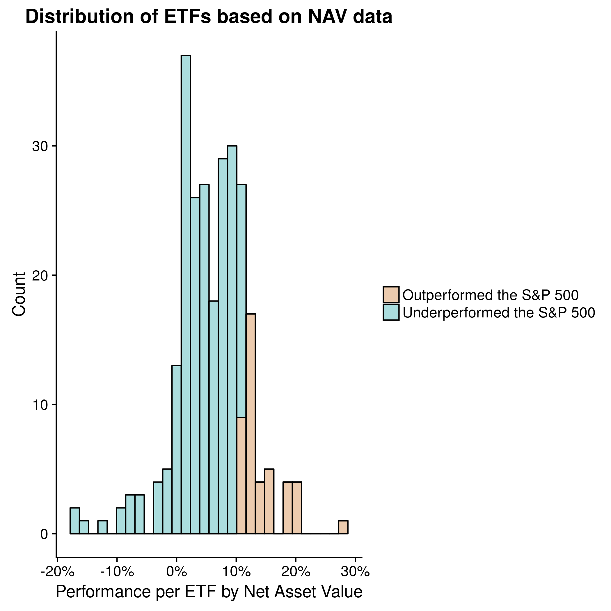
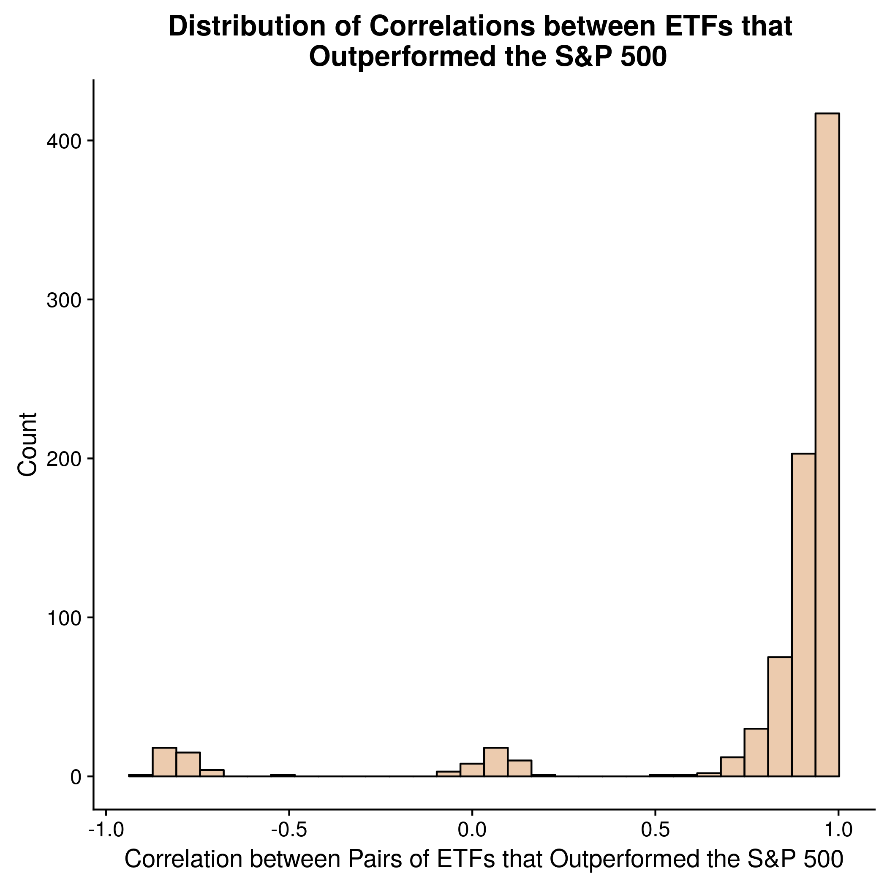

```{r setup, include=FALSE}
knitr::opts_chunk$set(echo = FALSE, warning = FALSE, message = FALSE,
                      fig.width = 8, fig.height = 6)
```

```{r}
library(tidyverse)
```

```{r}
require(timetk)
require(ezknitr)
```

# iShares ETF Analysis  

## Background
I'm currently reading the book [Principles by Ray Dalio](https://www.principles.com/). In it he describes his method to successful investing, which largely involves writing 'principle'-based algorithms for trading. He extends this to principle-based algorithms for an idea meritocracy which is largely why I am reading the book. In one part of the book, Mr. Dalio describes a eureka moment in which he realizes he can invest in higher risk assets as long as they have low correlation with one another. Thus he is able to diversify his portfolio by means of correlation - if a risky investment fails, at least it won't be correlated with his other riskier investments and he will be able to leverage that risk for a higher overall return. 

As someone with almost no investment knowledge but a growing statistical knowledge, I found this eureka moment fascinating. While my knowledge is very limited, I have been reading more about Exchanged Traded Funds (ETFs) as a less risky asset class - although I won't go into detail about them. My thought was if I could create a portfolio of ETFs that minimize correlation among them, I could choose ETFs with higher risk (and reward).  

## Hypothesis

My hypothesis is that among ETFs that outperform the market (approximated by iShares S&P 500 ETF with ticker IVV) there will be significant variation in correlation. The reason this is a significant question is that choosing ETFs with different correlations between them but that all have high returns will create a better a more balanced portolio with less overall risk. 

The caveat here is that 1) I mostly don't know what I'm talking about. 2) These are just ETFs that are performing well in the current market. If the market were to significantly change these ETFs may all change as well. What I am *not* doing is calculating beta compared to the S&P 500 (which is a future direction that I'll describe below). 


## Analysis

To begin my analysis, I read in the metadata the ETF from iShares by Blackrock. This had useful fields such as the ETF tickers, and corresponding performance as measured by Net Asset Value of the ETF either compounded monthly, or quarterly with data extending back as far as 10 years. Since I wanted to compare ETFs performance to the S&P 500 ETF (with ticker IVV), I needed to choose a performance metric. First I arbitrarily chose compounding monthly. 

I can choose the NAVs per ETF with data extending back to the beginning of the year, 1 year ago, 3 years ago, 5 years ago, or 10 years ago. The problem here is that ETFs are quite new, so if I extend too far back, I won't be able to compare many ETFs. On the other hand, 1 year may not be enough information to actually know if a given ETF outperforms the market.

```{r}

```

The above figure shows the proportion of the ETF data as it relates to the complete data set (i.e. the Year to Date - or the data since January). ETF performance as measured by NAV compounded monthly over the past **3 years** seems to be a healthy medium, keeping approximately 75% of the available data, while being enough time to get a sense for how well the ETF performs. This may not actually be long enough - see caveats at the end of this report.    

### Filtering for ETFs that Outperformed the S&P 500 

Now that we've decided we will be looking at NAV data over the past 3 years, let's further subset the data based on the ETFs that we care about - namely which ones outperformed the S&P 500. 


```{r}

```
The above figure shows counts for the numbers of ETFs that beat the S&P 500 over the past 3 years (recall: this is based on NAV changes compounded monthly). The light orange are all of those that beat the S&P 500. These are the ETFs that I care about for downstream analysis, so all analyses below references only this subset.  


### Correlations between Pairs of High Growth ETFs

What I really want to understand is if there is an opportunity to use low correlation between ETFs to mitigate risk and diversity an ETF portfolio, while still beating the S&P 500. Now that we have ETFs that beat the S&P 500 over the past 3 years, let's see how they are correlated to each other. 

With these data that beat the S&P 500, I queried Google Finance's API to get daily closing NAVs since Jan 1st, 2016 on each of the ETFs. Unfortunately this data was not available for all ETFs, so I subsetted again, keeping only ETFs with available data. I then generated a correlation matrix of all remaining ETFs.


Here is a sample correlation matrix with the first 5 ETFs and their relationship pairs.  
```{r}
corr_matrix <- read_csv("results/ishares_daily_corr_matrix.csv")
corr_matrix <- corr_matrix %>% rename(Tickers = X1)
corr_matrix[1:5,1:5]
```

I want to understand the distribution of ETF correlations among pairs, to see if it's possible to balance a portfolio of ETFs based on correlations among pairs. The distribution is a good start for this. 

```{r}

```

In the figure we can see a cluster of ETF pairs with near -1 correlation (negatively correlated), a cluster with near 0 correlation (poorly correlated) and the largest cluster with near 1 correlation. This means that compared to the majority of pairs, there are clusters that are correlated opposite and a cluster that have low correlation. This is very useful.

Let's say I plan on having an ETF portfolio with 5 ETFs. I have two already, and their relationship to one another is near 1.0. In order to mitigate the risk associated with this pair, I can now look to the negative correlation and poorly correlated ETF pairs, and add them to my portfolio so as to diversify. 

## Future Directions

While it's useful to manually look through the negative and poorly correlated clusters to diversify a portfolio, as more computational approach is to use linear programming with constraints to minimize for overall correlation between pairs among the 5 ETFs in my portfolio. The constraints can be the ETFs that I've already selected (in my example above 2 ETFs). 


## Caveats

Regression to the Mean: One problem with this analaysis is that it doesn't take into consideration the regression to the mean phenomenon. As eloquently described in Thinking Fast and Slow by Daniel Kahneman, this describes that when observing data that is far from the mean, the next observation will likely be closer to the mean. Daniel Kahneman's example is with military pilots - when they make a mistake and are yelled at, independent of the yelling they are less likely to make a mistake the next time (the probabiliy of making a mistake again - assuming independence - is just as high as it was in the first place). Likewise with performing very well. ETFs are no exception, and just because an ETF beat the market between 2014-2017, doesn't mean this trend will continue. Depending on various affects, regression to the mean dictates that these ETFs will actually perform poorly as compared to their previously exceptional performance.  


